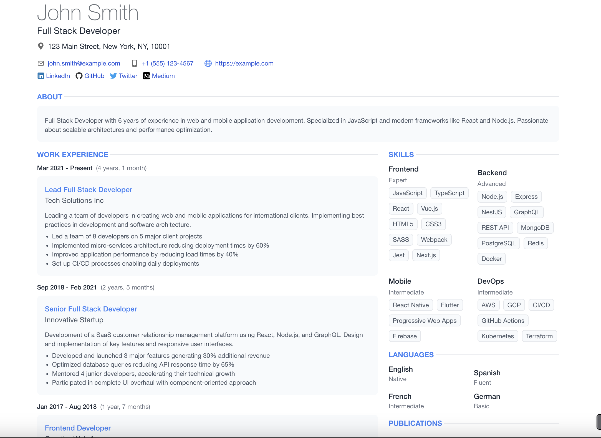

# JSON Resume Theme React



A modern, responsive React-based theme for [JSON Resume](https://jsonresume.org/), built with React, TypeScript, and Vite.

## Features

- 🚀 **Modern Stack**: Built with React 18, TypeScript, and Vite
- 🌐 **Multilingual Support**: Built-in internationalization with i18next
- 🎨 **Modern UI**: Clean, professional design with Tailwind CSS
- 📱 **Responsive Design**: Optimized for all devices
- 📝 **Markdown Support**: Rich text formatting in descriptions
- 🖨️ **Print-Friendly**: Optimized for PDF generation
- 🔍 **Type Safety**: Full TypeScript support with generated types

## Development

### Prerequisites

- Node.js 20+
- npm 9+

### Getting Started

1. Clone the repository:

   ```bash
   git clone https://github.com/phoinixi/jsonresume-theme-react.git
   cd jsonresume-theme-react
   ```

2. Install dependencies:

   ```bash
   npm install
   ```

3. Start the development server:

   ```bash
   npm run dev
   ```

4. Create your resume:

   - Place your `resume.json` file in the project root
   - For multiple languages, create files like `resume-fr.json`, `resume-de.json`, etc.

5. Build and render your resume:
   ```bash
   npm run render:resumed
   ```
   This will:
   - Build the theme
   - Render your resume
   - Output to `public/index.html`

### Multilingual Support

The theme supports multiple languages using the `language` property within your `resume.json` file. The theme uses `i18next` for internationalization, and translations are located in the `src/i18n` directory.

#### How it Works

1.  **Set the Language in `resume.json`:**
    Inside your `resume.json` file, specify the desired language code (e.g., `en`, `fr`, `de`) at the root level:

    ```json
    {
      "language": "fr", // Set this to the desired language
      "basics": {
        // ... your basic info
      }
      // ... rest of your resume data
    }
    ```

2.  **Rendering:**
    When you run the render script (`npm run render:local` or using `resumed`), the theme will read the root `language` property and load the corresponding translations.

    The rendered output file (`public/index.html` by default) will be in the language specified in the JSON.

3.  **Development Server:**
    The development server (`npm run dev`) will also respect the root `language` set in the `resume.json` file used for preview.

**Note:** While you _can_ maintain separate files like `resume-en.json`, `resume-fr.json` for organizational purposes, the theme itself only cares about the root `language` property within the specific JSON file being rendered or previewed.

### Available Scripts

- `npm run dev`: Start development server
- `npm run build`: Build the theme for production
- `npm run render:resumed`: Build and render your resume
- `npm run generate-types`: Generate TypeScript types from JSON schema
- `npm run test`: Run test suite
- `npm run lint`: Run ESLint
- `npm run format`: Format code with Prettier

## Project Structure

```
├── src/
│   ├── components/     # React components
│   ├── i18n/          # Internationalization
│   ├── styles/        # CSS and Tailwind config
│   ├── types/         # TypeScript types
│   └── utils/         # Utility functions
├── scripts/           # Build and render scripts
├── public/            # Static assets
└── resume.json        # Sample resume
```

## License

MIT

# Stack Overflow theme for jsonresume [](http://badge.fury.io/js/jsonresume-theme-stackoverflow)

**Printable version with custom CSS**

[DEMO](https://francescoesposito.dev/jsonresume-theme-stackoverflow/)

## Getting started

### Install the command line

Create your resume in json on [jsonresume](https://jsonresume.org)

The official [resume-cli](https://github.com/jsonresume/resume-cli) to run the development server.

Go ahead and install it:

```bash
npm install -g resume-cli
```

### Install and serve theme

Clone the repository

```bash
git clone https://github.com/phoinixi/jsonresume-theme-stackoverflow.git
```

Create a 'resume.json' file in the current folder and follow the [json resume schema](https://jsonresume.org/schema/)

Install dependencies:

```bash
npm install
```

and simply run:

```bash
resume serve --theme .
```

### PDF output

```bash
resume export resume.pdf -t stackoverflow
```

### Alternative way to create PDF

Download a precompiled binary from [wkhtmltopdf](https://wkhtmltopdf.org) and run your HTML document through the tool.

For example, if I really like the treatment Google has done to their logo today and want to capture it forever as a PDF:

```bash
wkhtmltopdf http://google.com google.pdf
```

### Social Profiles Icons

**Profiles supported with brand colors:**

Please note that all the [Font awesome brands icons](https://fontawesome.com/search?s=brands) are supported. Although only the ones listed below have a color code associated with it in my CSS file:

github, stack-overflow, linkedin, dribbble, twitter, facebook, pinterest, instagram, soundcloud, wordpress, youtube, flickr, google plus, tumblr, foursquare.

To have a social icon close the social link profile (or username) it is enough to set a `network` the name of the Social Network (es: 'Stack Overflow'). I am replacing spaces with dashes (`-`) and transforming all the network name to all lowercase to match the Font awesome naming convention for brands icons.

#### Support to extra fields

With stackoverflow theme it is possible to add:

- `keywords` to each 'work', 'publication' and 'volunteer' item
- `summary` to each 'interests' and 'education' item
- `birth` to 'basics' (might be commonly used in Europe)

example of the extra `birth` object:

```
"birth": {
  "place": "New York",
  "state": "USA",
  "date": "1988"
}
```

## Contribution

Fork the project, add your feature (or fix your bug) and open a pull request OR

[Open an issue](https://github.com/phoinixi/jsonresume-theme-stackoverflow/issues/new) if you find find or if you would like to have extra fields or changes

## License

Available under the [MIT license](http://opensource.org/licenses/mit-license.php).
